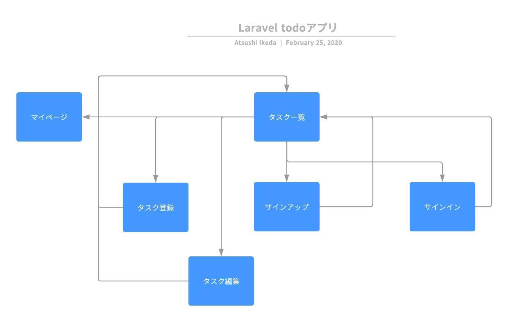
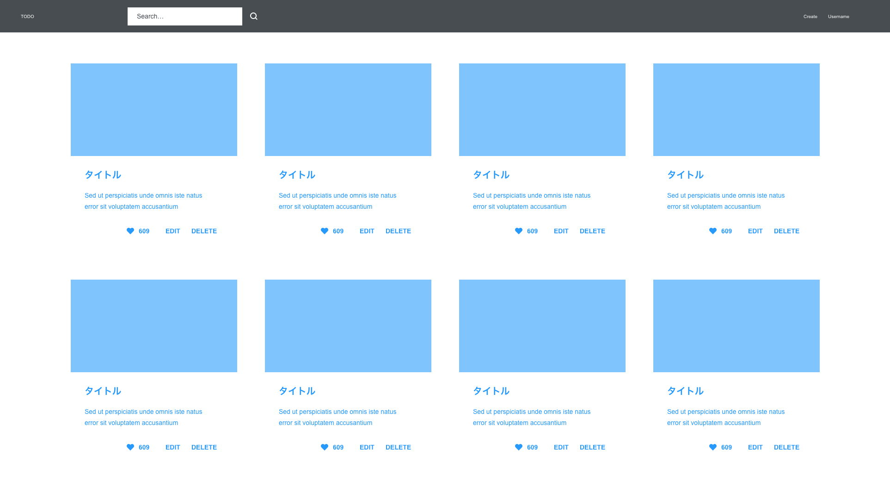
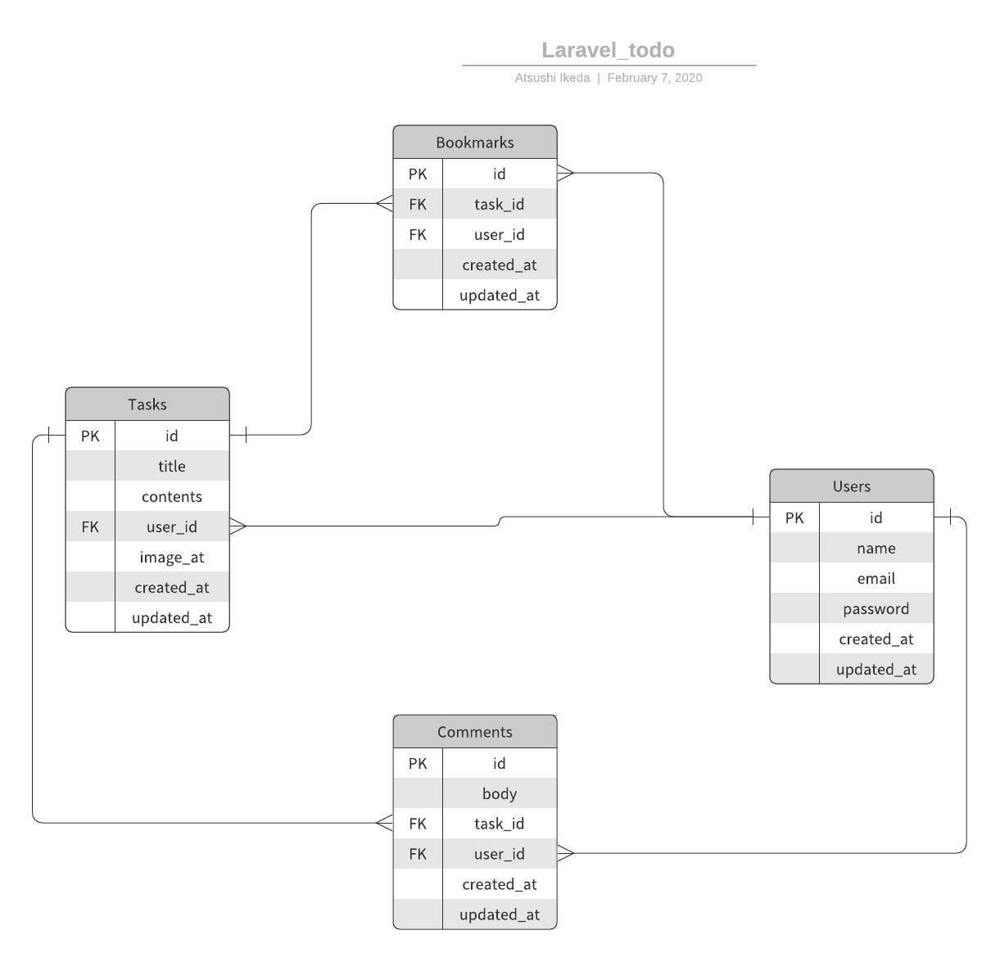

# Laravelを利用したTODOアプリの作成

## 実施する内容
- TODOアプリの作成(ミニチーム開発)

## 要件
### 機能一覧
#### 必須機能（CRUD処理の実装）
- タスクの作成ができる
  - 画像の投稿ができる
  - 以下のバリデーションを実装する
    - 入力必須
    - 30文字以内(title)
    - 140文字以内(contents)
- タスクの一覧表示ができる
- タスクの編集ができる
  - 以下のバリデーションを実装する
    - 入力必須
    - 30文字以内(title)
    - 140文字以内(contents)
- タスクの削除ができる
- 認証機能を擁している
  - サインアップ機能
  - サインイン機能
  - サインアウト機能

#### 任意
- タスクの表示順を登録日が新しい順にする
- タスクの検索ができる
- マイページの作成（詳細ページ）
  - 自分が投稿したタスクのみが表示される
- タスクのブックマークができる
- タスクのブックマークを解除することができる
- タスクにコメントができる
- 自分が投稿したタスクのみ編集できる
- 自分が投稿したタスクのみ削除できる

### ミニチーム開発の目的
- 優先度1：チーム開発におけるGitの使い方を習得する
- 優先度2：Laravelの理解を深める

### 質問
- 原則禁止
  - まずはチーム内での解決を目指す
  - 1時間トライしても解決しない場合は講師に質問

### 開発の流れ
- 役割分担を決める（下記は例）
  - モデル・マイグレーション作成→リーダー
  - UI作成
    - Topページ→〇〇さん
    - 新規登録ページ→〇〇さん
  - 新規登録→〇〇さん
  - 認証機能→〇〇さん
- それぞれ開発に取り掛かる
  - 必ずBranchを切って開発を進める
    - Branch名はわかりやすい名前をつける
- 担当箇所の実装が終わったら、リーダーが確認
  - git push → pull request → 確認 → OKならマージ
 
### 補足
- 変数名、クラス名はわかりやすい名前をつけましょう
  - ローマ字✕、予約語も意識
- UIにこだわる必要はありません
- タスク進捗をNotionなどを使用して管理しましょう
- var_dumpを活用しましょう
- すべてをまとめてやらずに1つ1つ順番に実施しましょう
- 1つ実装が終わったら必ず動作確認をしましょう

### 画面遷移図


### ワイヤーフレーム(TOPページ)


### ERD


### テーブル定義
### テーブル名: tasks
| 列名        | データ型    | NOT NULL | デフォルト | 備考                 |
| ----------- | ----------- | -------- | ---------- | -------------------- |
| id          | BIGINT      | YES      |            | PK                   |
| title       | VARCHAR(30) | YES      |            | タスクの題名が入る   |
| contents    | VARCHAR(140)| NO       |            | タスクの詳細が入る   |
| image_at    | TEXT        | NO       |            |                      |
| user_id     | BIGINT      | NO       |            |                      |
| created_at  | TIMESTAMP   | NO       |            | タスクの登録日       |
| updated_at  | TIMESTAMP   | NO       |            | タスクの更新日       |

### テーブル名: users
| 列名        | データ型    | NOT NULL | デフォルト | 備考                 |
| ----------- | ----------- | -------- | ---------- | -------------------- |
| id          | BIGINT      | YES      |            | PK                   |
| name        | VARCHAR(30) | NO       |            |                      |
| email       | VARCHAR(30) | NO       |            |                      |
| password    | VARCHAR(90) | NO       |            |                      |
| created_at  | TIMESTAMP   | NO       |            |                      |
| updated_at  | TIMESTAMP   | NO       |            |                      |

### テーブル名: bookmarks
| 列名        | データ型    | NOT NULL | デフォルト | 備考                 |
| ----------- | ----------- | -------- | ---------- | -------------------- |
| id          | BIGINT      | YES      |            | PK                   |
| task_id     | BIGINT      | NO       |            |                      |
| user_id     | BIGINT      | NO       |            |                      |
| created_at  | TIMESTAMP   | NO       |            |                      |
| updated_at  | TIMESTAMP   | NO       |            |                      |

### テーブル名: comments
| 列名        | データ型    | NOT NULL | デフォルト | 備考                 |
| ----------- | ----------- | -------- | ---------- | -------------------- |
| id          | BIGINT      | YES      |            | PK                   |
| body        | TEXT        | NO       |            |                      |
| task_id     | BIGINT      | NO       |            |                      |
| user_id     | BIGINT      | NO       |            |                      |
| created_at  | TIMESTAMP   | NO       |            |                      |
| updated_at  | TIMESTAMP   | NO       |            |                      |

## 環境構築手順
- リーダーがLaravelアプリ作成
  - 作成手順はブログアプリ資料を参照
  - プロジェクト名→todoチーム名

- ディレクトリの移動
```
cd todoチーム名
```

- 環境設定
  - envファイルをコピー
```
cp .env.example .env
```
  - .envファイルを自分の環境にあわせて修正

```
composer install

php artisan key:generate
```

- DBの準備
  DBの作成(phpMyAdmin)

- コンパイル
    ※ publicフォルダの中に `CSS` と `JS` のフォルダができます。
```
npm run dev
```

- ビルトインサーバの起動
```
php artisan serve
```

- ブラウザでページが表示できるか確認
```
http://localhost:8000/
```